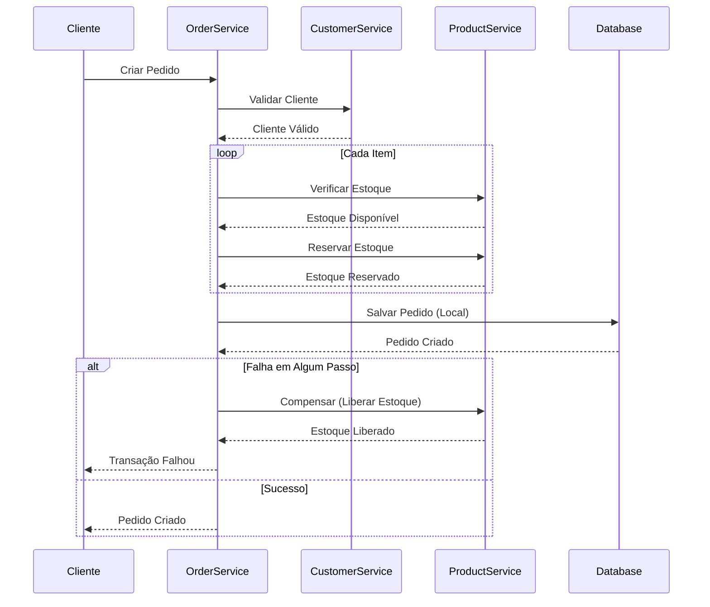

```markdown
# Sistema de Microsserviços com Saga Orquestrada

Um sistema de microsserviços pronto para produção implementando o padrão Saga orquestrada para transações distribuídas. Este projeto demonstra como transformar uma aplicação monolítica em serviços independentes enquanto mantém a consistência dos dados através de lógica de compensação explícita.

---

## 📋 Índice

* [Visão Geral](#visão-geral)
* [Arquitetura](#arquitetura)
* [Serviços](#serviços)
* [Stack Tecnológica](#stack-tecnológica)
* [Como Começar](#como-começar)
* [Endpoints da API](#endpoints-da-api)
* [Testando a Saga](#testando-a-saga)
* [Dívida Técnica Conhecida](#dívida-técnica-conhecida)
* [Roadmap](#roadmap)
* [Melhorias na Clean Architecture](#melhorias-na-clean-architecture)
* [Contribuição](#contribuição)
* [Licença](#licença)

---

## 🎯 Visão Geral

Este projeto transforma um sistema monolítico de gerenciamento de pedidos em uma arquitetura de microsserviços utilizando o padrão **Saga orquestrada**. O `order-service` atua como o orquestrador da Saga, coordenando com outros serviços via HTTP para manter a consistência em transações distribuídas.

### Principais Funcionalidades

* **Orquestração de Saga**: `order-service` coordena transações distribuídas entre múltiplos serviços.
* **Lógica de Compensação**: Rollback automático de etapas concluídas quando ocorrem falhas.
* **Clean Architecture**: Separação de responsabilidades com princípios de Domain-Driven Design.
* **Design Orientado a Eventos**: Eventos de domínio para consistência eventual e extensibilidade.
* **Autenticação JWT**: Autenticação serviço-a-serviço com controle de acesso baseado em roles.

---

## 🏗️ Arquitetura

### Visão Geral do Sistema

```text
┌─────────────────────────────────────────────────────────────┐
│                       API Gateway (Futuro)                  │
└───────────────────────────┬─────────────────────────────────┘
                            │
        ┌───────────────────┼───────────────────┐
        │                   │                   │
        ▼                   ▼                   ▼
┌───────────────┐   ┌───────────────┐   ┌───────────────┐
│   Customer    │   │    Product    │   │     User      │
│   Service     │   │    Service    │   │    Service    │
│    (8081)     │   │    (8082)     │   │    (8084)     │
└───────┬───────┘   └───────┬───────┘   └───────┬───────┘
        │                   │                   │
        └──────────────────┼───────────────────┘
                            │
                     ┌──────▼──────┐
                     │    Order    │ ◄── Orquestrador da Saga
                     │   Service   │
                     │    (8083)   │
                     └─────────────┘
                            │
                            ▼
                     ┌─────────────┐
                     │ PostgreSQL  │
                     │ (DB Comp.)  │
                     └─────────────┘

```

### Fluxo da Saga - Criar Pedido



---

## 🔧 Serviços

### 1. Customer Service (Porta 8081)

* Operações CRUD para clientes.
* Validação de clientes via HTTP.
* Endpoints: `/api/v1/customers/*`

### 2. Product Service (Porta 8082)

* Operações CRUD para produtos.
* Gerenciamento de estoque (aumentar/diminuir).
* Validação de disponibilidade de produtos.
* Endpoints: `/api/v1/products/*`

### 3. Order Service (Porta 8083) - Orquestrador da Saga

* Criação de pedidos com coordenação da Saga.
* Cancelamento de pedidos com compensação.
* Gerenciamento de status do pedido.
* Endpoints: `/api/v1/orders/*`

### 4. User Service (Porta 8084)

* Gerenciamento de usuários.
* Autenticação JWT.
* Controle de acesso baseado em roles.
* Endpoints: `/api/v1/users/*`, `/api/v1/auth/*`

---

## 🛠️ Stack Tecnológica

* **Linguagem**: Go 1.21+
* **Framework**: Chi Router
* **Banco de Dados**: PostgreSQL
* **Autenticação**: JWT
* **Testes**: Go standard testing + testify
* **Logging**: Logger customizado com logs estruturados
* **Migrações**: Migrações nativas em Go

### Estrutura do Projeto (Clean Architecture)

```text
cmd/                              # Entrypoints da aplicação
├── customer-service/
├── product-service/
├── order-service/
├── user-service/
└── seed/
internal/
├── application/                  # Casos de Uso
│   ├── commands/                 # Command Handlers
│   ├── queries/                  # Query Handlers
│   ├── dto/                      # Data Transfer Objects
│   ├── mapper/                   # Mapeamento Domínio para DTO
│   ├── validation/               # Validação de entrada
│   └── events/                   # Manipulação de eventos
├── domain/                       # Regras de Negócio
│   ├── entities/                 # Modelos de domínio
│   ├── valueobjects/             # Value objects
│   ├── repositories/             # Interfaces de repositórios
│   └── events/                   # Eventos de domínio
├── infrastructure/               # Preocupações externas
│   ├── database/                 # Implementações de banco
│   └── repositories/             # Implementações de repositórios
├── interfaces/                   # Adaptadores
│   ├── http/                     # Handlers e rotas HTTP
│   └── integration/              # Clientes de serviços externos
└── pkg/                          # Utilidades compartilhadas
    ├── jwt/
    └── logger/

```

---

## 🚀 Como Começar

### Pré-requisitos

* Go 1.21+
* PostgreSQL 14+
* Make (opcional)

### Instalação

Clone o repositório:

```bash
git clone [https://github.com/seu-usuario/go-microservice-order.git](https://github.com/seu-usuario/go-microservice-order.git)
cd go-microservice-order

```

Configure o ambiente:

```bash
cp .env.example .env
# Edite .env com suas credenciais do banco de dados

```

Configure o banco de dados:

```bash
# Crie o banco de dados
createdb -U postgres order_management

# Execute as migrações (via qualquer serviço)
go run ./cmd/customer-service/    # Auto-migra na inicialização

```

Execute os serviços (4 terminais separados):

```bash
# Terminal 1 - Customer Service
go run ./cmd/customer-service/

# Terminal 2 - Product Service
go run ./cmd/product-service/

# Terminal 3 - User Service
go run ./cmd/user-service/

# Terminal 4 - Order Service (Orquestrador)
go run ./cmd/order-service/

```

Popule os dados iniciais:

```bash
go run ./cmd/seed/

```

### Testando a Saga

```bash
# 1. Login para obter token JWT
curl -X POST http://localhost:8084/api/v1/auth/login \
  -d '{"email":"admin@example.com","password":"SenhaForte123!"}'

# 2. Crie um cliente (se necessário)
curl -X POST http://localhost:8081/api/v1/customers \
  -H "Authorization: Bearer <token>" \
  -d '{"name":"João Silva","email":"joao@example.com","cpf":"12345678900"}'

# 3. Crie um produto (se necessário)
curl -X POST http://localhost:8082/api/v1/products \
  -H "Authorization: Bearer <token>" \
  -d '{"name":"Notebook","price":1500.00,"stock":10}'

# 4. Crie um pedido (Orquestração da Saga)
curl -X POST http://localhost:8083/api/v1/orders \
  -H "Authorization: Bearer <token>" \
  -d '{
    "customer_id": "<id-do-cliente>",
    "items": [
      {"product_id": "<id-do-produto>", "quantity": 2}
    ]
  }'

```

---

## 📡 Endpoints da API

### Order Service (Porta 8083)

| Método | Endpoint | Descrição |
| --- | --- | --- |
| POST | `/api/v1/orders` | Criar pedido (Saga) |
| GET | `/api/v1/orders/:id` | Buscar pedido por ID |
| GET | `/api/v1/orders` | Listar pedidos |
| PUT | `/api/v1/orders/:id/pay` | Pagar pedido |
| DELETE | `/api/v1/orders/:id` | Deletar pedido |
| POST | `/api/v1/orders/:id/cancel` | Cancelar pedido (com compensação) |

### Customer Service (Porta 8081)

| Método | Endpoint | Descrição |
| --- | --- | --- |
| POST | `/api/v1/customers` | Criar cliente |
| GET | `/api/v1/customers/:id` | Buscar cliente |
| PUT | `/api/v1/customers/:id` | Atualizar cliente |
| DELETE | `/api/v1/customers/:id` | Deletar cliente |

### Product Service (Porta 8082)

| Método | Endpoint | Descrição |
| --- | --- | --- |
| POST | `/api/v1/products` | Criar produto |
| GET | `/api/v1/products/:id` | Buscar produto |
| PUT | `/api/v1/products/:id` | Atualizar produto |
| DELETE | `/api/v1/products/:id` | Deletar produto |
| PATCH | `/api/v1/products/:id/decrease-stock` | Diminuir estoque |
| PATCH | `/api/v1/products/:id/increase-stock` | Aumentar estoque |

---

## 🧪 Testando a Compensação

Teste a lógica de compensação da Saga criando um pedido com múltiplos itens onde o segundo produto tem estoque insuficiente:

```bash
# 1. Configure o primeiro produto com estoque > 0
# 2. Configure o segundo produto com estoque = 0
# 3. Crie pedido com ambos os produtos

curl -X POST http://localhost:8083/api/v1/orders \
  -H "Authorization: Bearer <token>" \
  -d '{
    "customer_id": "<id-do-cliente>",
    "items": [
      {"product_id": "<id-produto1>", "quantity": 2},
      {"product_id": "<id-produto2>", "quantity": 1} 
    ]
  }'
# Nota sobre o teste: O item 2 vai falhar.
# Resultado esperado: O estoque do primeiro produto é reservado e depois liberado automaticamente quando o segundo produto falha (compensação).

```

---

## ⚠️ Dívida Técnica Conhecida

Este projeto inclui intencionalmente simplificações que representam dívida técnica real para fins de aprendizado:

1. **Banco de Dados Compartilhado (Anti-Pattern)**
* *Atual:* Todos os serviços compartilham um único banco de dados. Os 4 serviços continuam acessando o mesmo Postgres.
* *Impacto:* Acoplamento entre serviços, ponto único de falha.
* *Futuro:* Cada serviço terá seu próprio banco/schema.


2. **Saga Síncrona (Sem Message Broker)**
* *Atual:* Saga orquestrada via chamadas HTTP síncronas. Sem fila de mensagens.
* *Impacto:* Operações bloqueantes, menos resiliente.
* *Futuro:* Kafka/RabbitMQ para coreografia assíncrona.


3. **Autenticação Simplificada entre Serviços**
* *Atual:* Token JWT interno com segredo compartilhado para autenticação serviço-a-serviço.
* *Impacto:* Menos seguro que service accounts adequadas.
* *Futuro:* mTLS ou OAuth2 client credentials.


4. **Compensação "Melhor Esforço"**
* *Atual:* Se a compensação falhar, a aplicação apenas registra o log. Sem mecanismo de retry.
* *Impacto:* Possível inconsistência se a compensação falhar.
* *Futuro:* Saga log com retries e idempotência.


5. **Sem Containerização**
* *Atual:* Cada serviço roda com `go run` em terminal separado. Sem Docker/orquestração.
* *Impacto:* Difícil reproduzir ambiente de produção.
* *Futuro:* Docker + Kubernetes.


---

## 🗺️ Roadmap

### Fase 1: Infraestrutura

* [ ] Dockerizar todos os serviços
* [ ] Docker Compose para desenvolvimento local
* [ ] Health checks e shutdown graceful
* [ ] Gerenciamento de configuração (Viper)

### Fase 2: Desacoplamento do Banco

* [ ] Banco de dados separado por serviço
* [ ] Migrações por serviço
* [ ] Réplicas de leitura para consultas
* [ ] Otimização de pool de conexões

### Fase 3: Integração com Mensageria

* [ ] Integração com Kafka/RabbitMQ
* [ ] Coreografia orientada a eventos
* [ ] Saga orquestrada assíncrona
* [ ] Dead letter queues e retries

### Fase 4: Observabilidade

* [ ] Tracing distribuído (Jaeger)
* [ ] Métricas (Prometheus)
* [ ] Logging centralizado (ELK)
* [ ] Service mesh (Istio/Linkerd)

### Fase 5: Pronto para Produção

* [ ] Deploy no Kubernetes
* [ ] Pipeline CI/CD
* [ ] Deploy Blue/Green
* [ ] Canary releases

### Fase 6: Padrões Avançados

* [ ] Circuit breakers (Resilience4j)
* [ ] Rate limiting
* [ ] API Gateway (Kong/Traefik)
* [ ] Service discovery (Consul)

---

## 🧹 Melhorias na Clean Architecture

### Pontos Fortes Atuais

* [x] Inversão de Dependência (interfaces no domínio)
* [x] Entidades independentes de frameworks
* [x] Casos de uso na camada de aplicação
* [x] Padrão Repository
* [x] Eventos de domínio

### Melhorias Futuras

* [ ] CQRS: Separar modelos de leitura e escrita
* [ ] Event Sourcing: Armazenar eventos como fonte da verdade
* [ ] Idempotência: Operações idempotentes para retries
* [ ] Serviços de Domínio: Lógica de negócio complexa no domínio
* [ ] Padrão Specification: Especificações de consulta reutilizáveis
* [ ] Aggregate Roots: Aplicar limites de consistência
* [ ] Coleções de Value Objects: Encapsular coleções

---

## 🤝 Contribuição

1. Faça o fork do repositório
2. Crie sua branch de feature (`git checkout -b feature/feature-incrivel`)
3. Commit suas mudanças (`git commit -m 'Adiciona feature incrível'`)
4. Push para a branch (`git push origin feature/feature-incrivel`)
5. Abra um Pull Request

**Diretrizes de Desenvolvimento:**

* Siga os princípios da Clean Architecture
* Escreva testes para todas as novas funcionalidades
* Atualize a documentação adequadamente
* Use mensagens de commit significativas
* Execute `go test ./...` antes de submeter

---

## 📝 Licença

Este projeto está licenciado sob a Licença MIT - veja o arquivo LICENSE para detalhes.

## 🙏 Agradecimentos

* Construído com princípios de Clean Architecture.
* Inspirado em Domain-Driven Design.
* Padrão Saga baseado em melhores práticas de sistemas distribuídos.

## 🔗 Referências

* Clean Architecture por Robert C. Martin
* Padrão Saga
* Domain-Driven Design
* Go Clean Architecture

> **Nota:** Este projeto é projetado para fins de aprendizado e demonstração. Os itens de dívida técnica conhecidos são intencionais para ilustrar a jornada do monolito para microsserviços e serão abordados em iterações futuras.

```

```
